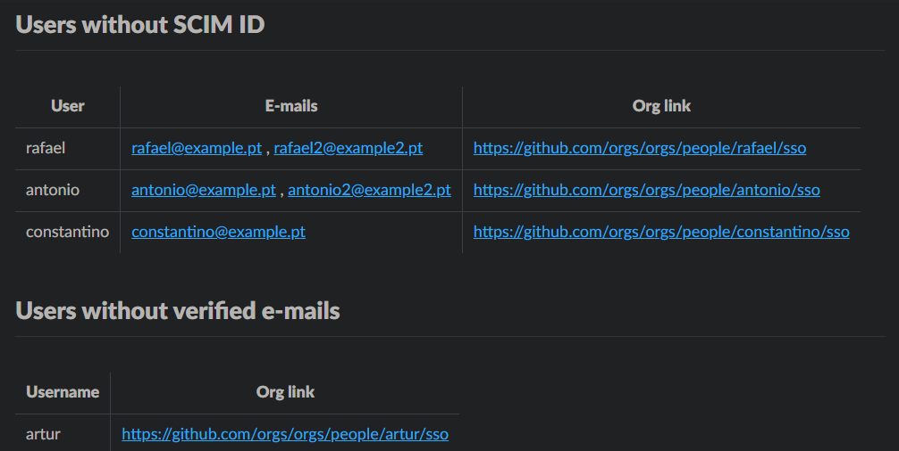

# GitHub Organization SCIM Identity Verification

This Python script helps detect drifts in SCIM provisioning within a GitHub organization by comparing organization members against SCIM-provisioned identities.

## Where Can I Use This Script?

This script can only be used in enterprise organizations where Single Sign-On (SSO) and SCIM are enabled.

## How Does It Work?

The script uses a GitHub App to authenticate against both GitHub REST and GraphQL APIs. It:

1. Retrieves all organization members and their verified emails via GraphQL
2. Gets all SCIM-provisioned identities via REST API
3. Compares both lists to identify any discrepancies

## Why Should You Use This Script?

To mitigate identity drifts between your Identity Provider (IdP) and GitHub that can lead to security issues and access management problems.

This script helps you:

- Identify users without SCIM provisioning
- Find users without verified organization emails
- Maintain alignment between your IdP and GitHub user base

## Prerequisites

### GitHub App Setup

1. Create a GitHub App in your organization with these permissions:
   - Organization permissions:
     - `members`: read-only
     - `administration`: read-only
2. Generate a private key for the GitHub App
3. Install the GitHub App in your organization
4. Note down:
   - `App ID`
   - `Installation ID`
   - Private key (base64 encoded or as a file)

### Required Environment Variables

- `GH_ORG`: GitHub organization name
- `GH_APP_ID`: GitHub App ID
- `GH_INSTALL_ID`: GitHub App Installation ID
- Either:
  - `GH_PEM_KEY`: Base64 encoded private key
  - `GH_PEM_KEY_PATH`: Path to private key file

### Optional Arguments

- `-o`, `--out-format`: Output format (table or `txt`). Default: table
- `--no-color`: Disable colored output

## Usage

### Standalone Usage

```sh
python compare-org-scim-users.py [-o {table,txt}] [--no-color]]
```

### GitHub Action Usage

```yaml
- name: Compare SCIM Identities
        uses: tentwentyone/github-org-members-verify-scim-identities@v1.0.1
        with:
          # GitHub App credentials
          gh_app_id: ${{ secrets.GH_APP_ORG_READ_ID }}
          gh_pem_key: ${{ secrets.GH_APP_ORG_READ_PEM_KEY }}
          gh_install_id: ${{ secrets.GH_APP_ORG_READ_INSTALL_ID }}
```

### Output Format

The script generates a report showing:

- Users without SCIM IDs
- Users without verified organization emails

When run in a GitHub Action, results are added to the workflow summary.

#### Example Output

Output when drifts or unverified emails are detected:



Output when no drifts / unverified emails are detected:


## Contributing

We welcome contributions! Please check our [contribution guidelines](CONTRIBUTING.md) for details.

## Security Policy

Please see our [guidelines](SECURITY.md) for details on our security policy and reporting security vulnerabilities.

## License

This project is released under the [MIT License](LICENSE).
